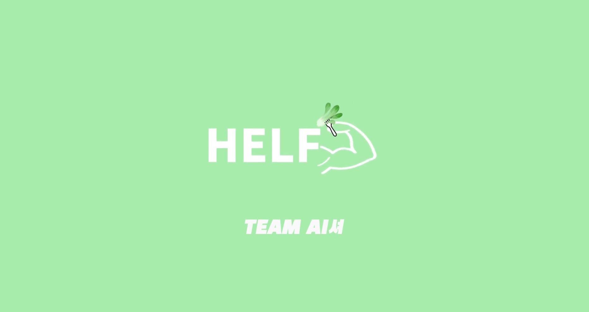
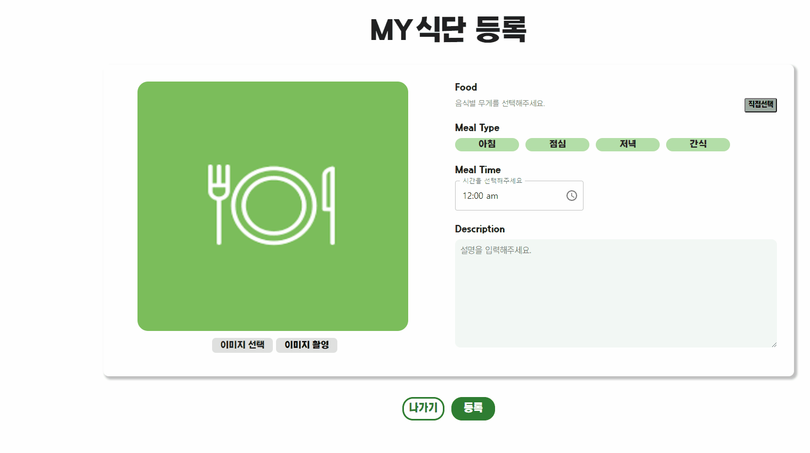
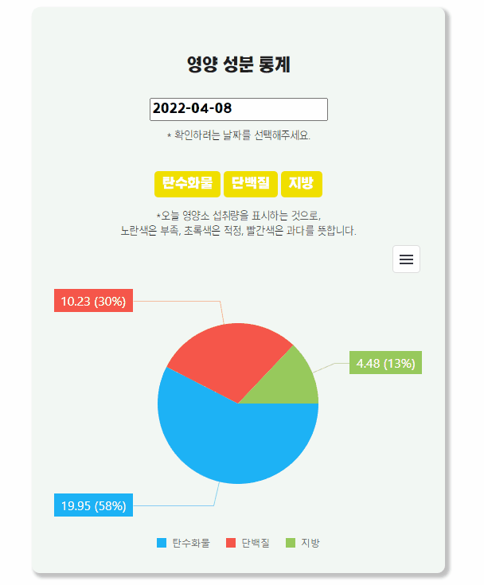
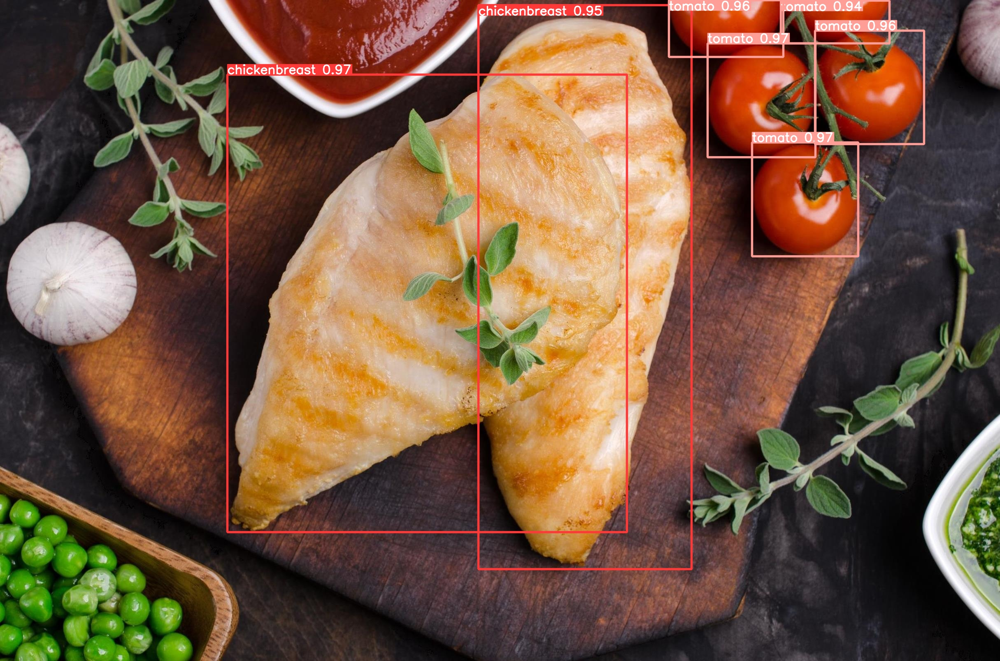
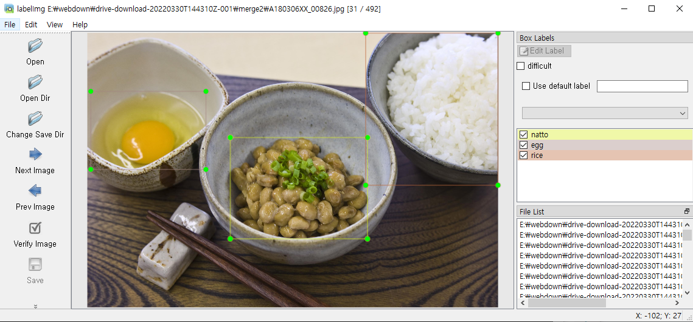
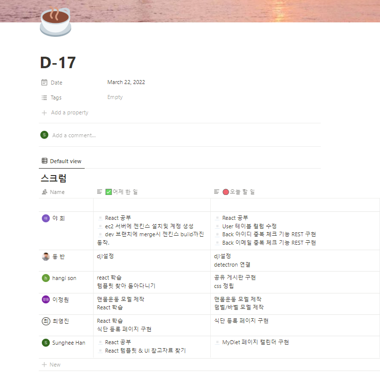
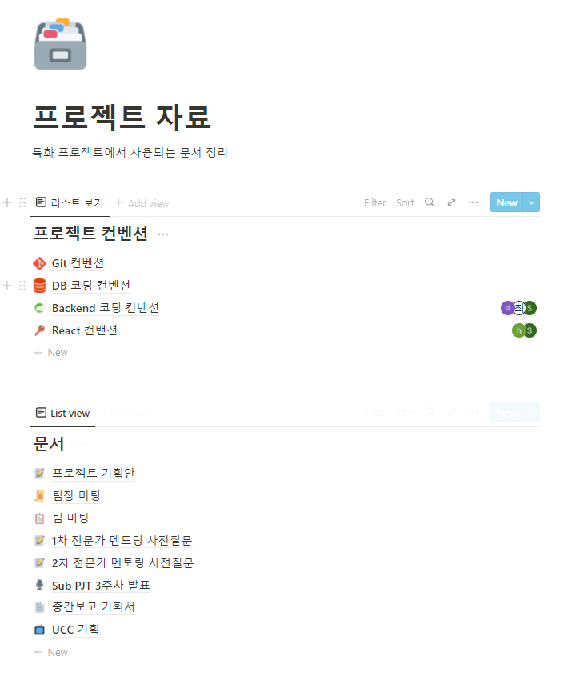
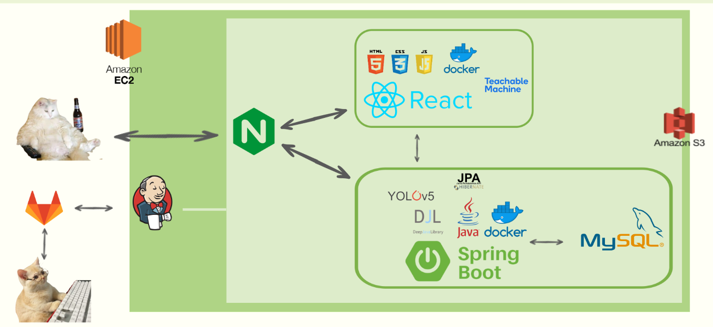
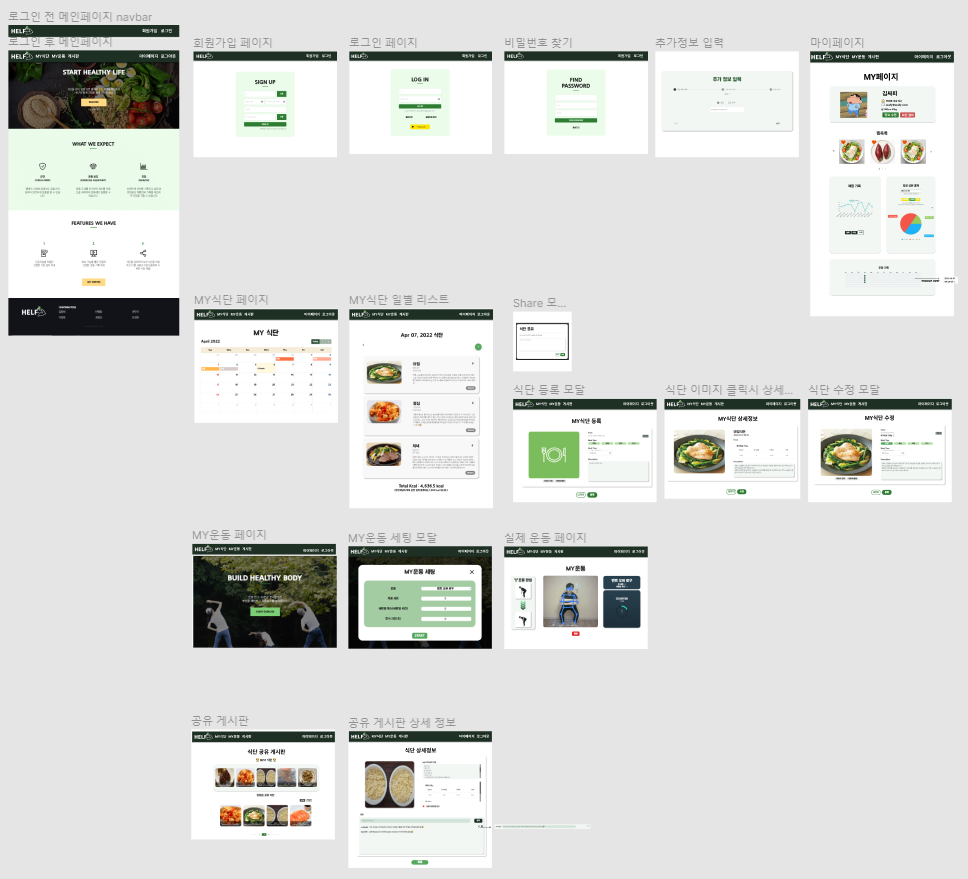
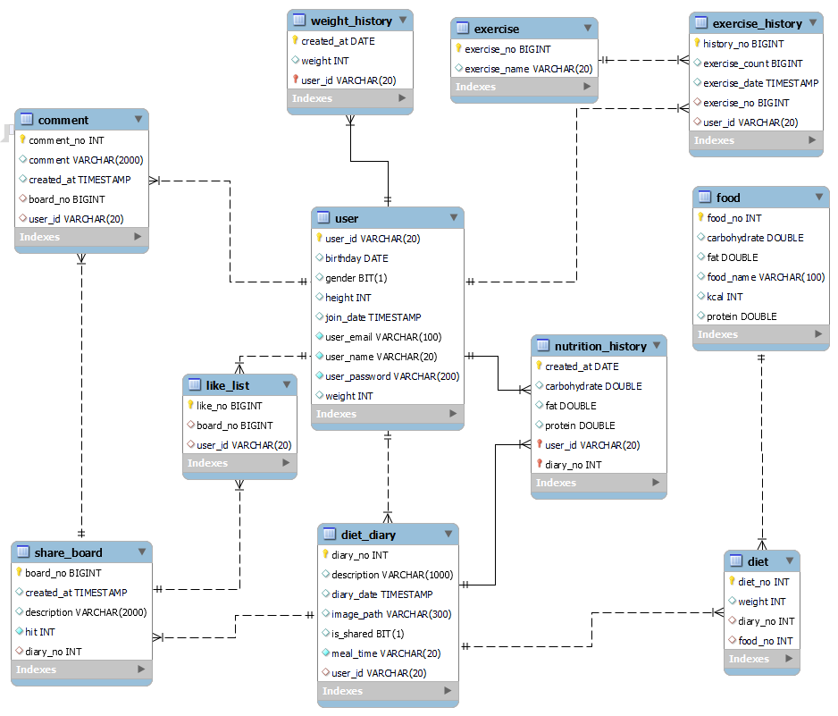

# Helth Friend(HELF)

# 1. 서비스 설명

### 개요

- **진행 기간** : **2022.02.21 ~ 2022.04.08(7주)**

- 한줄 소개 : 인공지능을 이용하여 간편한 식단 관리 및 기록과 간단한 맨몸 운동을 도와주는 서비스
- 서비스 명 : **헬프(HELF)**

<br/>

<br/>

# 2. 기획 배경

### 🖼 배경

우리는 **코로나19가 장기화**되면서 사회적 거리두기로 인한 **외출 자제로 무기력 및 우울감과 살이 찌는 등 건강이 안좋아 졌다**는 기사들을 보았습니다. `헬프`는 '이러한 문제점들을 **어떠한 서비스를 이용 하면 도움이 될까?' 에 집중**하였습니다.

따라서 `헬프` 는 **인공지능을 이용**하여 간편한 **식단 관리및 기록**과 **간단한 맨몸 운동을 도와**주며, 식단 **공유 게시판을 통하여 다양한 사람들의 식단 정보**를 얻을 수 있는 서비스를 만들게 되었습니다.

### 🎯 타겟

- 헬린이라 어떻게 운동을 시작할지 모르는 사람들
- 식단을 일일이 기록하기 귀찮은 사람들
- COVID-19로 인한 외출 자제로 살이 찌는 등 건강이 안 좋아져 홈트에 관심 있는 사람들

<br/>

<br/>

# 3. 서비스 화면

### 📺 시연영상

[](https://www.youtube.com/watch?v=JmRPuGKEBKg)

<br/>

<br/>

### 🛠 주요기능

<br/>

- 식단 기록

  

- 식단 공유

  <br/>

  

- 운동


- 통계

  <br/>

  - 영상 성분 통계

  

  - 체중 기록

  

  - 운동 기록

  

<br/>
<br/>

# 4. 기술스택

## API

`헬프` 에서는 , `헬프` 만의 차별점을 갖기 위해 다양한 API를 사용합니다.

### Teachable Machine [🔗](https://teachablemachine.withgoogle.com/)

> Teachable Machine은 누구나 머신러닝 모델을 쉽고 빠르고 간단하게 만들 수 있도록 제작된 웹 기반 API입니다. 특정 동작, 영상, 이미지 등을 학습시켜 이를 모델로 추출하여 클라우드에 업로드하면, 코드내에서 import하여 사용이 가능합니다.

`헬프` 에서는 `Teachable Machine` 을 사용하여 `운동 자세 체크 및 개수 측정`에 사용합니다.

`Teachable Machine` 을 통해서 `운동을 한다` 까지 인식시킬 수는 없습니다.

어떤 자세인지만 인식하는 것이 가능하며, 자세를 인식시킨 뒤, 알고리즘을 통해 대기자세에서 운동자세로 진행할 때, 다시 대기자세로 돌아올 때 와 같은 상황을 나누어, 운동이 진행되고 있음을 구분합니다.

먼저 아래 그림처럼 준비자세와 운동자세를 각각 학습시킵니다.


<br/>


학습시킨 모델은 티처블머신 사이트 상에서 위와 같이 나타나며, `자세를 인식`합니다.

앞을 바라보고 서있는 자세(맨 위)일 때 스쿼트 자세(위에서 세번째)로 인식 상태가 바뀌면 `운동중`으로 인식합니다.

스쿼트 자세에서 다시 서있는 자세로 돌아오면 운동 개수를 하나 카운트 하며, 원하는 횟수에 카운트값이 도달하면 운동의 해당 세트를 종료합니다.

### Deep Java Library 와 Yolov5

> Deep Java Library는 자바 환경에서 인공지능 모델 개발과 사용할 수 있도록 하는 AWS에서 발표한 인공지능 라이브러리 입니다.

> Yolov5는 object detection에서 많이 알려진 모델이며 R-CNN과 다르게 이미지 전체를 한번에 보는 특징이 있으며 속도가 매우 빠르다는 장점이 있다.

Deep Java Library를 사용 할 수 이도록 gradle을 이용하여 환경 설정을 했습니다.

Yolov5에서 커스텀 학습하기 위해 아래와 같이 데이터 라벨링을 진행했습니다.



Pytorch기반의 Yolov5를 실행시키기 위해 torchscript 형식으로 모델을 배포했습니다.

Yolov5를 이용하여 아래와 같이 입력된 이미지에서 음식을 검출했습니다.


<br/>
<br/>

# 5. 프로젝트 진행

프로젝트 진행 기간동안 전면 비대면으로, 온라인으로 진행되었기에 특히나 진행 방식과 소통 방법이 중요했습니다. 그래서 우리는 `Agile` 방법으로 프로젝트를 진행했고, Jira를 사용한 스프린트 관리, Discord를 활용하여 커뮤니케이션 소통을 하였습니다.

<br/>

## (1). Git Flow

git flow 사용을 위해 `우아한 형제들`의 [git flow 사용](https://techblog.woowahan.com/2553/)을 참고했습니다. 각자 맡은 기능에 맞게 `feature` 브랜치를 생성하고, 완료된 기능은 `develop`에 merge하여 사용했습니다. 충돌 상황을 최소화하고자 매일 오전 스크럼에 `develop` 최신 버전을 `pull`받고 시작할 것을 강조했습니다.

또한 `commit message` 는 `[feature/역할/기능] git 컨벤션` 와 같이 통일하여 작성했습니다.

```update : 기존의 기능 수정
- add : 새로운 기능 추가
- update : 기존의 기능 수정
- delete: 기존의 파일 삭제
- fix : 버그를 고친 경우
- rename : 이름 변경이 있을 때
- chore : 빌드 태스트 업데이트, 패키지 매니저를 설정하는 경우
- test : 테스트 코드 추가, 테스트 리팩토링
- build : 시스템 또는 외부 종속성에 영향을 미치는 변경사항 (npm, gulp, yarn 레벨)
- ci : CI관련 설정 style : 코드 의미에 영향을 주지 않는 변경사항 (포맷, 세미콜론 누락, 공백 등)
- refactor : 성능 개선
```

<br/>

## (2). Jira

매주 월요일 오전 회의에서 차주에 진행되어야 할 이슈를 백로그에 등록했습니다. 금주에 완료하지 못한 이슈나, 앞으로 진행할 이슈들을 추가합니다.

- 에픽은 가장 큰 단위 기준으로 구성하였습니다.

- 스토리는 실제 유저 플로우를 고려하여 `홈페이지에서 로그인 창을 통해 로그인 한다` 와 같이 작성하였으며,

- 이슈는 스토리를 완료하기 위한 작은 업무 단위로 생성했습니다.
- 에픽링크 태그를 사용하여 이슈를 구별하기 쉽게 했습니다.
- 무엇보다 담당자와 스토리 포인트 설정, 현재 작업중인 내용 지라에 실시간으로 반영하는 것을 가장 중요하게 생각했습니다.

<br/>

## (3). Notion

모두가 공유해야할 자료 및 링크는 노션에 정리했습니다. 특히 `userflow`나 `api 명세` 와 같이 여러번 다시 봐야하고 중요한 정보들은 특히 노션에 공유하여 불필요한 커뮤니케이션 리소스를 줄이기 위해 노력했습니다.

프로젝트 컨벤션, 문서, 참고자료, 산출물, 데일리 스크럼 등을 설정했습니다.



<br/>

<br/>

# 6. 배포

서버는 AWS EC2 ubuntu를 사용했습니다

<br/>

## (1). ⚙ 시스템 환경 및 구성



- OS: Windows10
- Backend Framework: Spring Boot 2.4.5
- Frontend Framework: React
- DB: mysql Ver 8.0.27 for Win64 on x86_64 (MySQL Community Server - GPL)
- WAS: Gradle
- JVM: openJDK (1.8.0_192)
- Node.js: 16.14
- Docker: 20.10.13
- WEB: Nginx (1.18.0)

<br/>

## (2). Docker

서로 다른 도커 이미지로 저장되어 있어 각각의 이미지를 실행시킵니다.

필요한 이미지들의 설정은 docker-compose.yml 파일에 작성합니다.

docker 내부는 같은 네트워크로 묶어주기 위해 docker-compose로 실행합니다.
<br/>

## (3). DevOps

`Jenkins`로 CI/CD를 구축하여 develop 브랜치에 `merge` 이벤트 발생시 build하도록 구성했습니다.

build 후 docker-compose를 실행하도록 했습니다.

<br/>

# 7. UI / UX

## (1). 와이어프레임(Figma)

figma를 사용해 홈페이지의 초안을 작성합니다. 관련 레퍼런스를 참고하고, 서비스 특성에 맞게 제작했습니다.



<br/>

<br/>

# 8. DB

## (1). ERD



<br/>
<br/>

# 9. 팀원 소개 및 소감

## 👩‍💻 팀원 소개

<br/>

|                    [김광희](https://github.com/heeya15)                    |                    [반형동](https://github.com/bandong92)                    |                             [손한기](https://github.com/onegi95)                              |                            [이정원](https://github.com/sorrow4468)                            |                  [최영진](https://github.com/youngjin98)                   |                            [한성희](https://github.com/ehhclaire)                             |
| :------------------------------------------------------------------------: | :--------------------------------------------------------------------------: | :-------------------------------------------------------------------------------------------: | :-------------------------------------------------------------------------------------------: | :------------------------------------------------------------------------: | :-------------------------------------------------------------------------------------------: |
|  |  |  |  |  |  |
|                     Front-end<br/>Back-end<br/>Dev-Ops                     |                               AI<br/>Back-end                                |                                        Front-end<br/>                                         |                                       AI<br/>Front-end                                        |                           Front-end<br/>Back-end                           |                                    Front-end<br/>Back-end                                     |

<br/>

### 🐮🍅 소감

- **김광희** : 이번 프로젝트로 처음 사용하는 IDE툴인 React 와 IntelliJ를 이용해 보자고 제가 의견을 내며 주제도 제가 생각한 주제가 선정되어 부담이 어느 정도 되었습니다. 그런데 팀원들 각자 맡은 역할에 책임감을 느껴 프로젝트에 임해 주며 팀원들의 장점이 모여 서로의 부족한 점을 보완할 수 있었고, 팀원들과 함께라면 어떠한 것도 해낼 수 있을 거 같다는 자신감이 있었습니다. 이번 `특화` 프로젝트를 통해 처음 하는 Jenkins와 React, IntelliJ 등 많이 배우며 성장했고, Git Flow, Jira를 사용하여 비대면 상황이더라도 효율적으로 소통하고 협업하는 법을 익힐 수 있었습니다. 체력적(잠을 못 잠)으로 정신적으로(Local에선 되는데 Server 배포한 곳에선 왜 안 되지?) 많이 힘들었지만, 팀원들과 소통하며 문제를 잘 해결해 나아갔고, 저 스스로 정말 열정적으로 프로젝트에 임했다고 자부할 수 있습니다. 마지막으로 우리 팀원들 모두 수고했고 AI셔(아이셔)팀 화이팅!!😀

- **반형동** : 이번 프로젝트를 하며 새로운 시도를 많이 해봤습니다. java 환경의 서버에서 인공지능을 서비스 할 수 있는 DJL을 처음 공부하면서 중간중간 어려운 부분도 있었지만, 열심히 노력하여 좋은 결과를 얻을 수 있었습니다. 또한, 좋은 팀원들을 만나 소통도 잘했고 서로서로 부족한 부분을 채우면서 프로젝트를 잘 완성할 수 있었습니다.

- **손한기** : 처음 react를 사용하면서 정말 많이 헤매고 어려웠던 것 같습니다. 하지만 팀원들이 너무 열정적으로 잘해 주었고 든든한 백엔드 친구들 덕분에 수월하게 프로젝트 진행할 수 있었던 것 같아요! 많이 배웠습니다. ㅎㅎ

- **이정원** : 개발자에게 필요시 되는 역량 중 소통능력은 늘 강조됩니다. 어문계열을 전공하며 다양한 사람들을 만나오면서 키운 소통능력에 자신이 있었습니다만, 이번 프로젝트를 통해 "개발자에게 필요한 소통능력은 제가 생각하던 것과는 조금 다르구나" 라는 생각을 하게 되었습니다. 크게 두 가지 다른 점을 느꼈습니다.
  첫 번째, 개발자 간에 기술적인 대화가 오갈 때 가장 중요하다고 느낀 것은 서로 이해하고 있는 기술 수준 정도의 차이라는 것을 느꼈습니다. 뛰어난 팀원들과 함께하고, 그 속에 있으면서 제 스스로 기술력이 많이 부족해 보였고, 오가는 대화 자체를 제가 이해하는 데 어려움이 많았습니다. "모르면 물어봐야지"와는 결이 조금 달랐습니다. 베이스로 삼고 있는 지식의 정도 차이가 많이 났고, 온전히, 저의 기본이 많이 부족하다는 것을 느꼈습니다. 하지만 이는 어찌 보면 모두가 겪는, 겪었던 과정일 것이며 지속적인 기술학습을 통해 앞으로 해결해 나가려고 합니다.
  두 번째, 자기객관화가 뒷받침된 근거 있는 대화가 중요하다고 생각했습니다. 이번에 티처블머신을 통해 운동을 인식하는 파트를 맡았습니다. 처음에는 "어렵지 않다는데, 하면 되지 않을까?"라는 생각으로 시도하였으나 많이 어려웠습니다. 그렇다고 "안된다"고 말하기에는 이미 "하겠다"고 말을 하였기 때문에 스스로 마일스톤을 잡아놓고 책임감을 갖고 완성하려 하였습니다. 하지만 끝내 스스로 완성하지 못했고 모델을 연결하고 구현하는 작업은 팀원들의 도움을 받았습니다. 기존에는 두루뭉술하게, 되지 않을까 정도로 행동하였는데, 개발자는 보다 더 스스로를 객관적으로 보고, 된다 안된다를 확실히 하고 가야겠다는 생각을 했습니다. 이는 첫 번째 내용과도 이어지며, 꾸준한 배경지식 학습의 중요성을 다시 한 번 느끼게 되었습니다.

- **최영진** : React와 Intellij를 선택하면서 한 번도 사용해보지 않은 툴이라 걱정이 앞섰지만, 그만큼 더 많이 공부하고 시간을 앞당겨 개발하고자 노력했습니다. 그 결과 라이브러리를 이용해 필요한 요소를 간단하게 도입하면서 React에 더 흥미가 생겼고, QueryDSL을 이용해 쿼리를 간편하게 작성하고 오류를 쉽게 파악할 수 있었습니다. S3를 이용한 이미지 업로드나 pageable을 이용한 정렬 등 다루지 않았던 기능들을 다루면서 많은 오류를 맞이하고 어려움을 겪기도 했지만, 결과적으로 간편하게 이미지를 관리하고 코드의 중복을 줄일 수 있어 뿌듯했습니다. 😊 그리고 반응형 사이트를 개발하면서 스타일링에 대해 더 많이 배울 수 있어 바쁘지만 즐거운 개발이었습니다!! 마지막으로 6주 동안 비대면으로 진행하면서 힘들었겠지만, Git, Jira, Notion을 이용해 더 많이 소통하고 진행사항을 공유했던 팀원들 모두 너무 수고 많으셨습니다. 😆

- **한성희** : Back-end에서 시작해서 Front-end로 마무리한 프로젝트였습니다. 6명이 한 팀이 되어 Jira 로 매주 월요일 스크럼 회의를 진행하고 정해진 팀 git flow에 따라서 코드를 관리하며 협업을 경험할 수 있었습니다. 👨‍👩‍👧‍👦 7주간 팀원과 함께 각자의 역할을 수행하며 발생하는 오류들을 같이 해결해봄으로써 함께 성장할 수 있었고 SpringBoot, JPA 뿐만 아니라 처음 사용해본 React를 활용하여 프로젝트를 마칠 수 있었습니다. 코드의 완성도를 위한 야근으로 체력적으로 많이 힘들었지만 😪 이렇게 완성된 코드를 보니 피로가 싹 가시는 것 같습니다. 팀원 모두가 으쌰으쌰 하며 열심히 해줬기 때문에 동기부여가 되었고 그 결과 지치지 않고 끝까지 최선을 다할 수 있었다고 생각합니다! AI셔(아이셔) 팀원들 고마웠습니다~!! 👐

  <br/>
